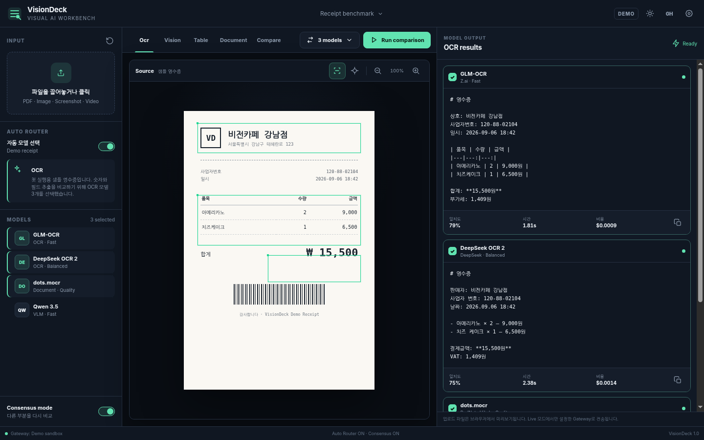

# VisionDeck

PDF·사진·Screenshot·영상을 여러 Vision/OCR 모델로 같은 화면에서 비교하고, Auto Router와 Consensus 지표로 적합한 결과를 빠르게 찾는 Visual AI 워크벤치입니다.

## Preview



첫 실행부터 샘플 영수증과 GLM-OCR, DeepSeek OCR 2, dots.mocr 결과 비교 흐름을 바로 테스트할 수 있습니다. 로컬 파일을 드래그하면 이미지·PDF·영상 미리보기로 전환되고 파일 종류에 따라 Auto Router가 추천 모델을 갱신합니다.

## Features

- PDF / Image / Screenshot / Video Drag & Drop
- 원본 미리보기, Zoom, Bounding Box 토글, Selection 모드
- OCR / Vision / Table / Document / Compare 탭
- GLM-OCR / DeepSeek OCR 2 / dots.mocr / Qwen 3.5 모델 선택
- Auto Router: 파일 타입·파일명 패턴을 이용한 모델 추천
- Consensus Mode: 모델 결과 간 토큰 일치도 휴리스틱 계산
- Demo Mode: API 없이 전체 UX 즉시 테스트
- Live Gateway: OpenAI-compatible endpoint 호출
- Dark / Light theme 저장
- GitHub Pages 하위 경로 대응 Vite base 자동 설정
- 404, favicon, app icon, manifest, OG preview, JSON-LD
- 키보드 focus 및 반응형 레이아웃

## Important API note

VisionDeck는 GitHub Pages에서 동작하는 정적 프론트엔드입니다. 비밀 API Key를 소스에 포함하지 않습니다.

- Settings의 API Key는 현재 탭 메모리에서만 사용되고 LocalStorage에 저장되지 않습니다.
- 이미지 로컬 파일은 Live mode에서 data URL로 전송을 시도합니다.
- PDF·video 로컬 파일은 브라우저 정적 환경의 업로드/CORS 제약 때문에 public URL 또는 별도 Serverless Proxy가 필요할 수 있습니다.
- VLM Run Gateway의 anonymous access / rate limit / alpha 정책은 변경될 수 있으므로 배포 전 공식 문서를 확인하세요.

## Tech Stack

- HTML5
- CSS3 design tokens
- JavaScript ES Modules
- Node.js build/dev scripts (external dependency 없음)
- Browser File API / LocalStorage

## Project Structure

```text
/
├─ public/
│  ├─ favicon.svg
│  ├─ favicon-32x32.png
│  ├─ apple-touch-icon.png
│  ├─ icon-192.png
│  ├─ icon-512.png
│  ├─ og-image.png
│  ├─ repo-social-preview.png
│  ├─ app-preview.png
│  ├─ manifest.webmanifest
│  ├─ robots.txt
│  ├─ 404.html
│  └─ .nojekyll
├─ src/
│  ├─ data/
│  ├─ lib/
│  ├─ styles/
│  └─ main.js
├─ scripts/
│  ├─ build.mjs
│  ├─ check.mjs
│  └─ serve.mjs
├─ .github/workflows/deploy.yml
├─ .env.example
├─ index.html
├─ package.json
└─ README.md
```

## Local Development

```bash
npm install
npm run dev
```

기본 주소: `http://localhost:5173/`

## Build

```bash
npm run build
```

결과물은 `dist/`에 생성됩니다.

## GitHub Pages Deployment

1. 새 GitHub Repository를 만들고 이 프로젝트를 push합니다.
2. 기본 브랜치를 `main`으로 사용합니다.
3. Repository → **Settings → Pages**로 이동합니다.
4. **Build and deployment → Source**를 `GitHub Actions`로 선택합니다.
5. `main`에 push하면 `.github/workflows/deploy.yml`이 자동 빌드/배포합니다.
6. 모든 정적 리소스는 상대 경로를 사용하므로 `/<REPOSITORY>/` 하위 경로에서도 정상 동작합니다.

배포 URL 예:

```text
https://USERNAME.github.io/REPOSITORY/
```

## Configuration

`.env.example`을 참고해 필요할 때만 다음 값을 설정합니다.

- `VITE_SITE_URL`: OG/canonical 절대 URL
- `VITE_SITE_URL`: 빌드 시 canonical / Open Graph 절대 URL에 사용

GitHub Actions에서는 Repository owner/name을 이용해 기본 GitHub Pages URL을 자동 계산합니다. 정적 리소스 자체는 상대 경로이므로 별도 base 설정이 필요하지 않습니다.

## Custom Domain

1. Repository Settings → Pages → Custom domain에 도메인을 입력합니다.
2. DNS에서 GitHub Pages 안내에 맞춰 A/AAAA 또는 CNAME 레코드를 설정합니다.
3. 커스텀 도메인 빌드에서는 `VITE_SITE_URL=https://example.com/`으로 설정하세요.
4. GitHub Pages에서 **Enforce HTTPS**를 활성화하세요.
5. 필요하면 `public/CNAME`에 도메인 한 줄을 추가할 수 있습니다.

## Security / Privacy

- API Secret, PAT, password, private key는 public repository에 커밋하지 않습니다.
- 민감한 영수증·세금계산서 등을 외부 AI API로 보낼 때는 해당 공급자의 저장·처리·학습 정책을 확인하세요.
- 실제 업무 배포는 인증 정보를 숨길 수 있는 Serverless Proxy 또는 자체 Backend를 권장합니다.

## License

샘플 프로젝트 코드는 MIT License 사용을 권장합니다. 실제 공개 시 `LICENSE` 파일을 추가해 조직 정책에 맞게 확정하세요.
